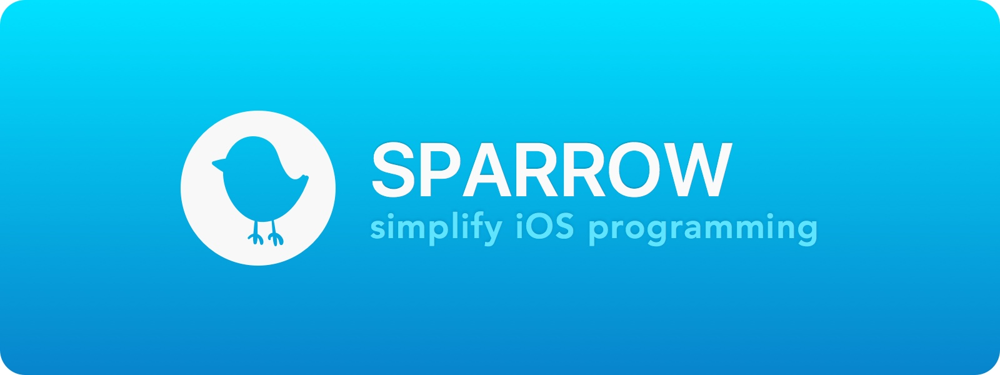
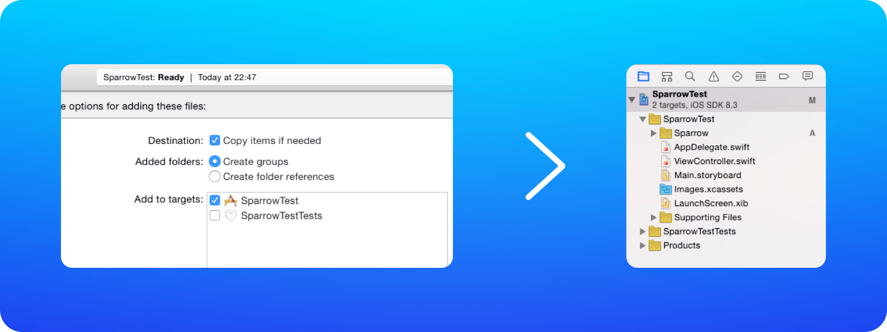
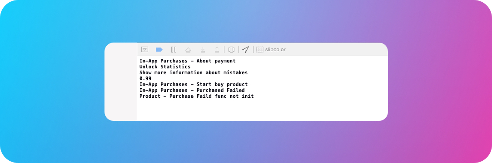

## Description
A library to simplify iOS programming in Swift.

## Installation
Drop in the Sparrow folder to your Xcode project.

## In-App Purchase

    var purchase = Product(productID: "ID")
    purchase.funcWithPurchased = {
        println("Bought")
    }
    buy(purchase)

## Game Center

    authorizateInGameCenter()
    saveHighscore(30, toLiderboard: "LiderboardID")
    showLeaderboard("LeaderboardID")

# Achivment

    var achivment = createAchivment("achivmentID")
    achivment.setPercentCompleteTo(100)
    sendAchivmentToServer([achivment])

# Banner

    showNotificationBannerWithTitle("Sparrow", messege: "Simplify iOS programming")

## Sound

    var audio = audioPlayer(fileName: "sparrow.mp3")
    audio.play()

or else

    var audio = audioPlayer()
    audio.playSound("sparrow.mp3")
    audio.playSound("colibri.wav")

## Detailed Report

## License
Sparrow is released under the MIT license. See LICENSE.md for details.